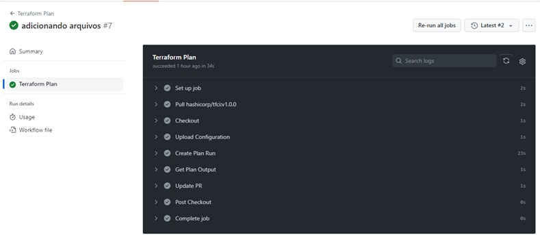
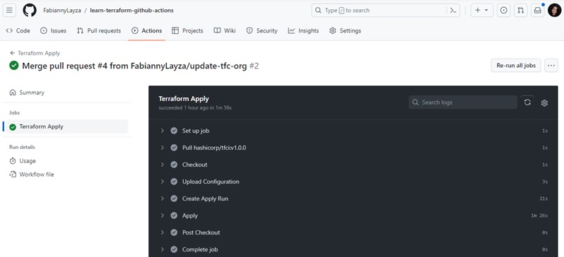
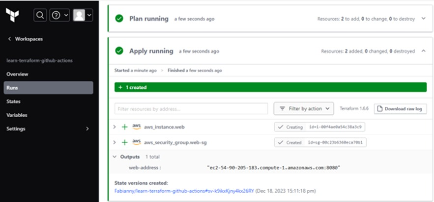
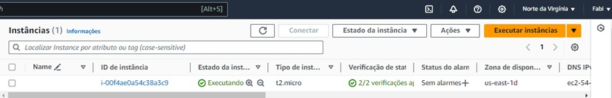
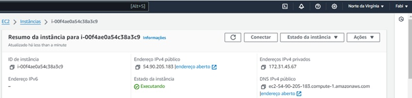
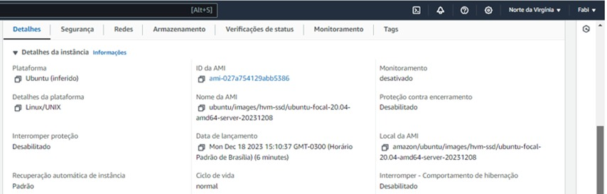
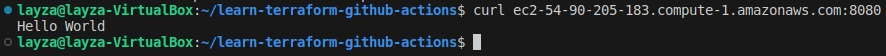

# Atividade - Terraform + AWS + Github Actions

Utilizando a seguinte documentação (Documentação Hashicorp: https://developer.hashicorp.com/terraform/tutorials/automation/github-actions) Realize todo o passo a passo que está descrito na documentação para no final realizar o provisionamento de uma EC2 através do github actions.
Para comprovar que fez a atividade crie um repositório no seu perfil pessoal do github cole abaixo o link depois de realizar todo o passo a passo.

Obs: pode usar esse repositório como apoio: https://github.com/hashicorp-education/learn-terraform-github-actions/blob/main/main.tf que está descrito na documentação acima, basta realizar um fork ou baixar e realizar upload no seu perfil pessoal.

Passos para nota

1. Criação do Repositório - Vale 1,0 ponto
O aluno vai disponibilizar o link público para o repositório, o último commit deve ser feito antes da data e tempo limite.
2.  A máquina criada – Vale 2,0 pontos
O aluno vai adicionar ao repositório um print do console da AWS, mostrando a EC2 no console da AWS
3. A pipeline funcionando – Vale 3,0 pontos
O aluno vai adicionar ao repositório o arquivo YML da Pipeline (que será analisado para verificação de execução com sucesso)
4. A aplicação funcionando – Vale 4,0 pontos
O aluno vai adicionar ao repositório um print com o curl fazendo requisições para o endereço público
ATENÇÃO! O link para o repositório deve ser colocado como resposta à atividade.

2 pontos

## Prints

### Terraform Plan

### Terraform Apply

### Terraform Cloud

### AWS Instance

### Curl request working
